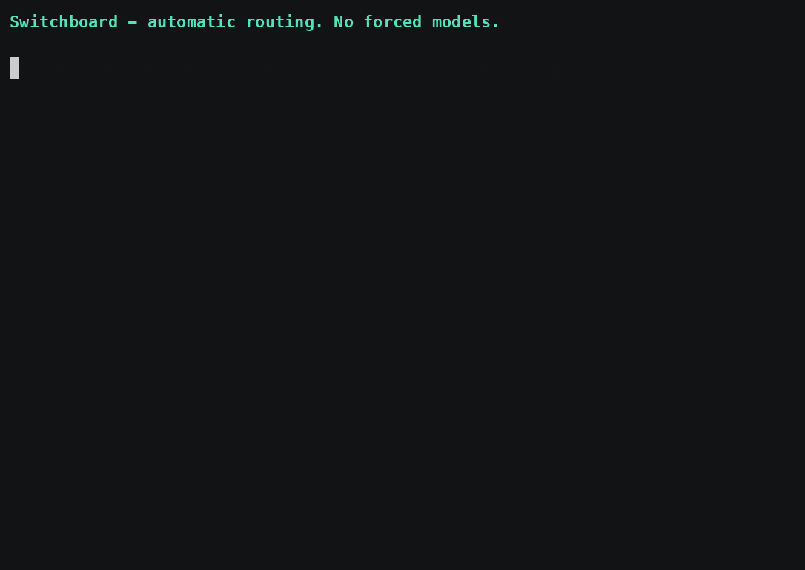

<h1 align="center">Switchboard</h1>

<p align="center"><strong>A privacy-aware, local-first router across your CLI coding agents and local LLMs.</strong></p>

> **Why this matters now.** In mid-2026, employers started *rationing* AI: Uber capped engineers at $1,500/month per AI coding tool after burning its 2026 AI budget in four months ([Bloomberg](https://www.bloomberg.com/news/articles/2026-06-02/uber-caps-usage-of-ai-tools-like-claude-code-to-cut-costs)); Microsoft is moving its Experiences + Devices org off Claude Code to GitHub Copilot CLI ([Windows Central](https://www.windowscentral.com/microsoft/microsoft-cancels-claude-code-licenses-shifting-developers-to-github-copilot-cli-a-move-likely-driven-by-financial-motives)). A spend cap is a blunt instrument: it throttles your best engineers and does nothing about proprietary code leaving for third-party models. The structural fix is **routing, not rationing** — a thin local-first layer that sends only what's worth it to a premium model, keeps sensitive work on-device, and compresses context.
>
> **Switchboard is a reference implementation of that pattern.** On a 100-case benchmark it kept **62% of requests off premium agents** (38% premium usage) at near-premium quality, full coverage, and **zero measured privacy leaks** [(see the benchmark below)](#proof). It is not (yet) an enterprise product — it's the smallest honest proof that the pattern works, with a reproducible benchmark to back it.

<p align="center">
  <a href="https://github.com/aivinay/switchboard/actions/workflows/ci.yml"></a>
  <a href="https://pypi.org/project/switchboard-local/"></a>
  
  <a href="LICENSE"></a>
  <a href="https://doi.org/10.5281/zenodo.20836918"></a>
</p>

<p align="center">
  <a href="#get-started-60-seconds">Install</a> ·
  <a href="#how-it-works">How it works</a> ·
  <a href="#context-memory-and-tokens">Context</a> ·
  <a href="#proof">Proof</a> ·
  <a href="#privacy">Privacy</a> ·
  <a href="#the-paper">Paper</a> ·
  <a href="docs/">Docs</a>
</p>



---

> Switchboard routes prompts to the right model while preserving context through
> local semantic memory and context compression, keeping sensitive work local,
> and reducing unnecessary premium-model usage.

It's built for the single-workstation setup where the scarce resources aren't
dollars-per-token but **subscription quota**, **privacy**, and a pile of
**heterogeneous agent interfaces**.

## What it does

- **Routes** across local [Ollama](https://ollama.com) models, the **Codex** CLI, and **Claude Code** — deterministic rules first, with optional tiny learned classifiers for recall.
- **Private mode** — a deterministic keyword/PII/secret-format floor blocks sensitive prompts from ever reaching a subscription backend, even on fallback.
- **Grounds** answers with deterministic tools (time/date, safe calculator, unit conversion, keyless live stock & news) instead of letting a model guess.
- **Carries context** across backend switches: recent user, assistant, and tool turns are assembled into one redacted session prompt.
- **Compresses** long context with a Headroom-inspired layer; the model-boundary pass only summarizes recent conversation, while trusted facts, retrieved memory, and the current request survive intact.
- **Remembers** across backends via local embedding-based semantic memory, with SQLite search available for direct memory lookup.
- **Explains every decision** and records metadata-only telemetry (no prompt/response bodies).
- **Ships its own evaluation** — a 100-case quality benchmark, a local LLM-as-judge, and a multi-run statistical harness.

## How it works

```
  UI / CLI  ──►  Session manager (shared history across all backends)
                      │
                      ▼
              Capability detector (regex) ◄──► deterministic tools
                      │  (learned tool dispatcher recovers misses; tool verifies)
                      ▼
              Privacy floor  (keywords + PII + secret formats — a match is FINAL)
                      │  (learned sensitivity escalator may only ADD protection)
                      ▼
              Deterministic policy   ← always wins; unknown ⇒ local
                      │  (learned router supplies recall: tool / local / coding / reasoning)
                      ▼
              Context builder + redaction ◄── semantic memory
                      │
                      ▼
              Compression (metadata + history-only context pass)
                      │
                      ▼
        Ollama (default) │ Codex (coding) │ Claude Code (reasoning)
                      │
                      ▼
              Response sanitizer ─► metadata-only telemetry
```

The organizing invariant: **deterministic policy always precedes and overrides
the learned components.** Privacy, tool grounding, forced selection, and
fallback keep working even when the local model runtime — and therefore every
learned component — is down.

## Get started (60 seconds)

```bash
pip install switchboard-local
```

```bash
# point it at a local model runtime (install Ollama, then pull a small model)
ollama pull llama3.2:3b

# sanity-check your setup
switchboard doctor

# ask — Switchboard routes it, grounds it, and tells you why
switchboard ask "summarize this error log and suggest a fix"

# see the routing decision without running anything
switchboard route "refactor the auth module and add tests"

# prefer your browser? launch the local web UI, then open http://127.0.0.1:8080/ui
switchboard ui
```

Requires **Python 3.11+**. Codex / Claude Code backends are optional — without
them, everything routes locally. See [docs/usage.md](docs/usage.md).

## Context, memory, and tokens

Switchboard has two user-facing CLI surfaces:

- `switchboard route ...` previews the same core backend decision without calling a model.
- The web UI, bare `switchboard ask ...`, and `switchboard ask --backend auto ...` use the stateful core workflow: shared sessions, model switching, semantic-memory retrieval, context-boundary compression, and backend telemetry all run on the same path.

Example stateful CLI session:

```bash
switchboard ask --backend auto --new-session "Remember: prefer local models for private notes."
switchboard ask --backend auto --session <session_id> --memory "What should you remember?"
```

Long prompts and long sessions record token estimates and savings metadata. The request-level pass can shorten an oversized raw prompt; the context-boundary pass then compresses only `<recent_conversation>`. The `<trusted_facts>`, `<long_term_memory>`, and `<current_user_request>` blocks are protected from that second pass so grounding and intent are not traded away for token budget.

Memory is local. `switchboard memory add` stores the item in SQLite and, when `semantic_memory_enabled` is on and Ollama can serve `nomic-embed-text`, indexes an embedding for cross-backend retrieval. `switchboard memory search` works as local text search even when embeddings are unavailable.

Details: [docs/context-memory-compression.md](docs/context-memory-compression.md).

## Proof

A 100-case benchmark across five task categories (coding, reasoning,
summarization, private, grounding), run on real backends and judged by a local
model, over **multiple independent runs** (means shown; full per-condition
numbers, confidence intervals, and significance tests are in the paper):

| Policy            | Quality (1–5) | Premium usage | Privacy leaks | Answered |
|-------------------|:-------------:|:-------------:|:-------------:|:--------:|
| always-local      | 3.4           | 0%            | **0**         | 100%     |
| rules             | 3.8           | 27%           | **0**         | 100%     |
| hybrid            | 3.9           | 28%           | **0**         | 100%     |
| **learned**       | **4.1**       | 38%           | **0**         | 100%     |
| always-premium    | 4.6           | 100%          | **0**         | 61%¹     |

<sub>¹ The "just use the premium agent for everything" baseline must <em>block</em> every
sensitive prompt to stay leak-free, so its coverage collapses — exactly the gap
Switchboard closes. <strong>Zero measured leaks in every condition and every run.</strong></sub>

These numbers come from a real-backend benchmark whose full harness travels with the paper's [reproduction bundle on Zenodo](https://doi.org/10.5281/zenodo.20836918).

## Privacy

Switchboard is local-first and privacy-aware by construction:

- The **deterministic privacy floor runs before any non-local routing**; a positive verdict is final and cannot be overridden by a learned component or by prompt wording.
- **Secret-format detection** (cloud keys, JWTs, PEM blocks, env credentials) shares its patterns with context redaction, so the routing boundary and the redactor can't drift apart.
- **Metadata-only telemetry** — prompt and response bodies are not stored by default.
- Semantic-memory **embeddings and the eval judge run locally**.

Switchboard deliberately does **not** resell API access, scrape web UIs, or
bypass provider limits — subscription CLIs are invoked exactly as the
authenticated user could invoke them, in read-only sandbox modes. See
[SECURITY.md](SECURITY.md) and [docs/privacy.md](docs/privacy.md).

<details>
<summary><b>What's inside</b></summary>

- **Deterministic router** — keyword rules; unknown prompts default local-first.
- **Learned router / tool dispatcher / sensitivity escalator** — tiny softmax classifiers over a locally-computed embedding (~50 ms, pure-Python inference), each retrainable in seconds from your own thumbs-down corrections behind golden-accuracy gates. They fail closed to the deterministic path.
- **Tools** — time/date with timezones, safe abstract-syntax-tree calculator, unit conversion, keyless live stock quotes & news.
- **Compression** — structure-aware, deterministic, dependency-free; preserves task header, code blocks, tracebacks, and grounded facts.
- **Semantic memory** — `nomic-embed-text` embeddings, cosine retrieval, local memory commands, and SQLite text-search fallback for direct search.
- **Evaluation** — mock evals (CI), real-backend smoke suite, 100-case quality benchmark, adversarial tester/developer dogfooding loop.

</details>

## Configuration

Settings live in `config/personal.yaml` (ships with safe local-first defaults —
see `config/personal.example.yaml`). Highlights:

```yaml
preferences:
  router_mode: "learned"      # rules | llm | hybrid | learned
  private_mode: true          # block sensitive prompts from non-local backends
  allow_cloud: false
  compression_enabled: true
  compression_threshold_tokens: 1000
  semantic_memory_enabled: true
  semantic_memory_top_k: 3
  finance_provider: "yahoo"
  news_provider: "google_news_rss"
```

Provider API keys are referenced **by environment-variable name** (e.g.
`OPENAI_API_KEY`), never inline. See [docs/overrides.md](docs/overrides.md).

## The paper

Switchboard is described in a preprint — *"Privacy-Aware Hybrid Routing Across
Heterogeneous AI Agents."* The manuscript, the multi-run
benchmark harness, the statistical-aggregation and figure scripts, and the
per-case records are archived together as a reproduction bundle on Zenodo:
[10.5281/zenodo.20836918](https://doi.org/10.5281/zenodo.20836918).

This repository ships only the software. It deliberately does not carry the
paper's experiment-running or figure-generation tooling — that lives with the
archival record so the code stays focused on the router itself.

## Development

```bash
make install     # .venv + editable install with dev extras
make check       # ruff + mypy + the full test suite
```

See [CONTRIBUTING.md](CONTRIBUTING.md). Issues and PRs welcome — please preserve
the privacy invariant described there.

## Citing Switchboard

A preprint is available on Zenodo with a citable DOI —
[10.5281/zenodo.20836918](https://doi.org/10.5281/zenodo.20836918). See
[CITATION.cff](CITATION.cff) for machine-readable metadata.

> V. Gupta, "Switchboard: Privacy-Aware Hybrid Routing Across Heterogeneous AI
> Agents," Zenodo, 2026, doi:10.5281/zenodo.20836918.

## License

[MIT](LICENSE) © 2026 Vinay Gupta
